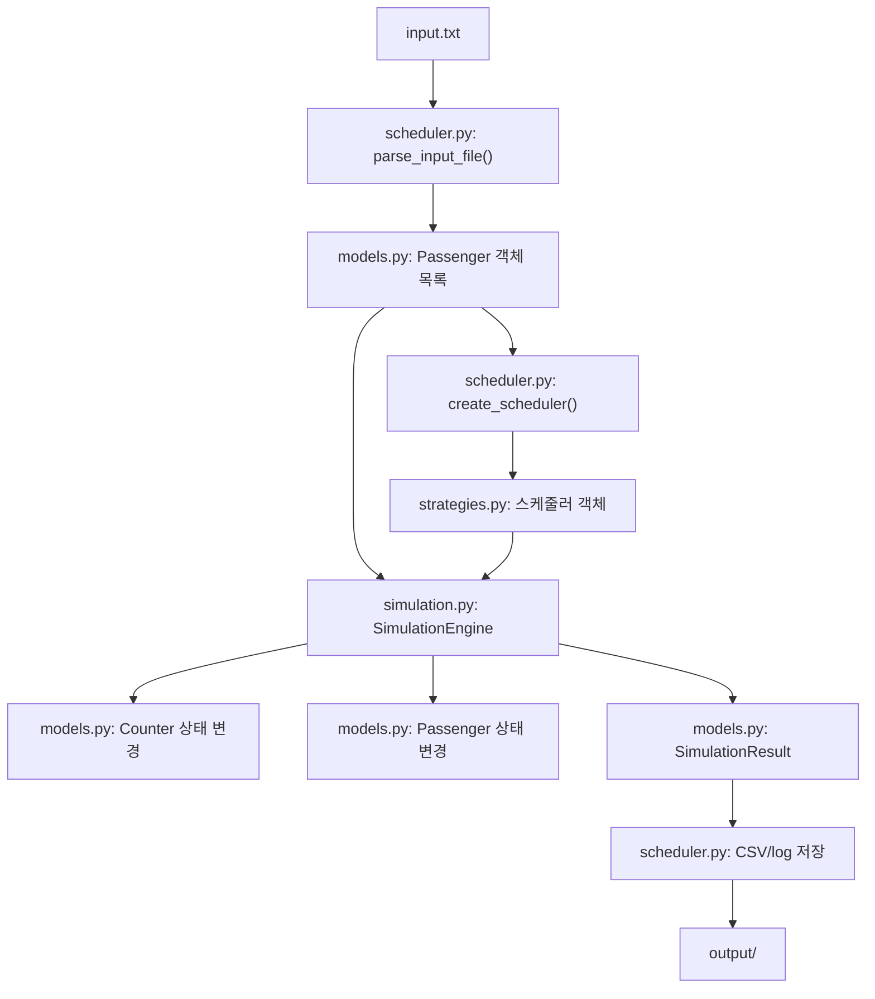
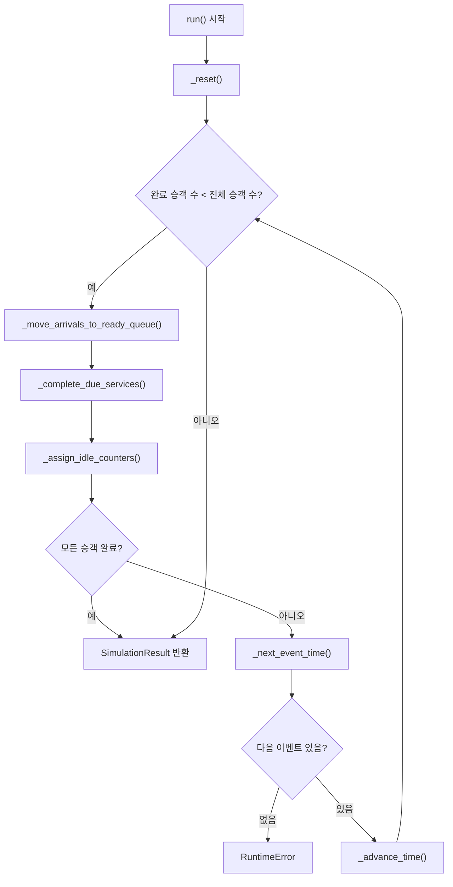

# 핵심 시뮬레이션 흐름 설명

## 파일의 역할

`core_simulation_flow.md`는 `models.py`와 `simulation.py`를 중심으로 프로젝트의 실행 흐름을 한 번에 이해하기 위한 문서입니다.

두 파일의 역할을 간단히 나누면 다음과 같습니다.

- `models.py`: 승객, 카운터, 결과를 표현하는 데이터 구조를 정의합니다.
- `simulation.py`: 시간 흐름에 따라 승객 도착, 서비스 시작, 서비스 완료를 처리합니다.

추가로 주변 파일까지 포함하면 전체 구조는 다음과 같습니다.

- `scheduler.py`: 입력 파일을 읽고, 스케줄러를 선택하고, 결과 파일을 씁니다.
- `strategies.py`: FCFS, Priority, SJF, OurScheduler 같은 스케줄링 알고리즘을 제공합니다.
- `report_utils.py`: 결과 비교 그래프 등을 만드는 보조 기능을 제공합니다.
- `input.txt`: 승객 입력 데이터입니다.
- `output/`: 실행 결과 CSV, 로그, 그래프가 저장되는 폴더입니다.

## 전체 구조

프로젝트의 큰 흐름은 다음과 같습니다.



초보자 관점에서 가장 중요한 연결은 이것입니다.

```python
engine = SimulationEngine(passengers=passengers, enable_log=True)
result = engine.run(scheduler)
```

- `SimulationEngine`은 시뮬레이션을 실행하는 엔진입니다.
- `passengers`는 `Passenger` 객체 목록입니다.
- `scheduler`는 다음 승객을 골라 주는 알고리즘 객체입니다.
- `result`는 최종 결과인 `SimulationResult` 객체입니다.

## 코드 설명

### 1단계: 입력 파일에서 승객 정보 읽기

`input.txt`에는 다음처럼 승객 정보가 들어 있습니다.

```text
1   0   3   7
2   0   1   12
3   1   3   5
```

각 줄은 다음 의미입니다.

| 위치 | 의미 | 예시 |
| --- | --- | --- |
| 1번째 값 | 승객 ID | `1` |
| 2번째 값 | 도착 시간 | `0` |
| 3번째 값 | 승객 등급 | `3` |
| 4번째 값 | 서비스 시간 | `7` |

등급 숫자는 `models.py`에서 다음처럼 정의되어 있습니다.

```python
FIRST = 1
BUSINESS = 2
ECONOMY = 3
```

즉 위 첫 줄은 "승객 1번이 시간 0에 도착했고, Economy 등급이며, 서비스 시간은 7"이라는 뜻입니다.

### 2단계: `Passenger` 객체 만들기

`scheduler.py`는 입력 파일을 읽어서 다음과 같은 형태로 `Passenger` 객체를 만듭니다.

```python
Passenger(
    passenger_id=passenger_id,
    arrival_time=arrival_time,
    passenger_class=passenger_class,
    service_time=service_time,
)
```

이때 `Passenger` 클래스는 `models.py`에 정의되어 있습니다.

```python
@dataclass
class Passenger:
    passenger_id: Any
    arrival_time: int
    passenger_class: int
    service_time: int
    service_start_time: Optional[int] = None
    completion_time: Optional[int] = None
    turnaround_time: Optional[int] = None
    assigned_counter_id: Optional[str] = None
```

처음 객체를 만들 때 채워지는 값은 보통 다음 네 가지입니다.

- `passenger_id`
- `arrival_time`
- `passenger_class`
- `service_time`

아래 네 가지는 시뮬레이션 도중 채워집니다.

- `service_start_time`
- `completion_time`
- `turnaround_time`
- `assigned_counter_id`

예를 들어 첫 번째 승객은 처음에는 대략 다음 상태입니다.

```python
Passenger(
    passenger_id=1,
    arrival_time=0,
    passenger_class=3,
    service_time=7,
    service_start_time=None,
    completion_time=None,
    turnaround_time=None,
    assigned_counter_id=None,
)
```

`None`은 아직 값이 없다는 뜻입니다.

### 3단계: 스케줄러 객체 만들기

`scheduler.py`는 사용자가 선택한 이름에 따라 스케줄러 객체를 만듭니다.

예를 들어 `"ours"`를 선택하면 `OurScheduler()`가 만들어집니다.

스케줄러는 모두 다음 메서드를 제공합니다.

```python
select_next_passenger(
    ready_queue,
    counters,
    current_time,
    counter,
)
```

이 메서드의 역할은 "현재 대기 중인 승객 중에서 이 카운터에 배정할 승객 한 명을 골라라"입니다.

`simulation.py`는 이 메서드 이름만 알고 있으면 됩니다. 내부 알고리즘이 FCFS인지, Priority인지, SJF인지, OurScheduler인지는 몰라도 됩니다.

### 4단계: `SimulationEngine` 만들기

```python
engine = SimulationEngine(passengers=passengers, enable_log=True)
```

이 코드가 실행되면 `simulation.py`의 생성자가 실행됩니다.

```python
self.passengers = sorted(deepcopy(passengers), key=lambda passenger: passenger.sort_key())
self.counters = deepcopy(counters) if counters is not None else create_default_counters()
self.enable_log = enable_log
self.current_time = 0
self.ready_queue: list[Passenger] = []
self.completed_passengers: list[Passenger] = []
self.event_log: list[str] = []
```

각 줄의 의미는 다음과 같습니다.

- `deepcopy(passengers)`
  - 승객 목록을 깊게 복사합니다.
  - 원본 승객 객체를 직접 바꾸지 않기 위해서입니다.

- `sorted(..., key=lambda passenger: passenger.sort_key())`
  - 승객을 도착 시간과 승객 ID 순서로 정렬합니다.

- `self.counters = ...`
  - 카운터 목록을 준비합니다.
  - 별도로 받은 카운터가 없으면 `create_default_counters()`로 기본 카운터를 만듭니다.

- `self.current_time = 0`
  - 시뮬레이션 시간을 0에서 시작합니다.

- `self.ready_queue = []`
  - 아직 서비스 시작 전인 대기 승객 목록입니다.

- `self.completed_passengers = []`
  - 완료된 승객 목록입니다.

- `self.event_log = []`
  - 이벤트 로그 목록입니다.

기본 카운터는 `models.py`에서 다음처럼 만들어집니다.

```python
def create_default_counters() -> list[Counter]:
    return [
        Counter("C1", COUNTER_FIRST),
        Counter("C2", COUNTER_BUSINESS),
        Counter("C3", COUNTER_ECONOMY),
        Counter("C4", COUNTER_FLEX),
        Counter("C5", COUNTER_FLEX),
    ]
```

## 핵심 실행 흐름

### 전체 반복 구조

`simulation.py`의 핵심은 `run()` 메서드입니다.

```python
while len(self.completed_passengers) < total_passenger_count:
    next_arrival_index = self._move_arrivals_to_ready_queue(next_arrival_index)
    self._complete_due_services()
    self._assign_idle_counters(scheduler)

    if len(self.completed_passengers) >= total_passenger_count:
        break

    next_time = self._next_event_time(next_arrival_index)
    if next_time is None:
        raise RuntimeError("Simulation cannot continue because no future event exists.")

    self._advance_time(next_time)
```

이 반복문은 모든 승객이 완료될 때까지 계속됩니다.

한 번의 반복에서 하는 일은 항상 같은 순서입니다.

1. 현재 시간까지 도착한 승객을 대기열로 넣습니다.
2. 현재 시간에 서비스가 끝난 승객을 완료 처리합니다.
3. 빈 카운터가 있으면 스케줄러에게 물어보고 승객을 배정합니다.
4. 모든 승객이 끝났는지 확인합니다.
5. 아직 끝나지 않았으면 다음 이벤트 시간으로 이동합니다.

### 흐름 그림



## 단계별 자세한 설명

### 단계 1: 초기화

```python
self._reset()
```

초기화는 다음 일을 합니다.

- 현재 시간을 0으로 되돌립니다.
- 대기열을 비웁니다.
- 완료 승객 목록을 비웁니다.
- 로그를 비웁니다.
- 각 승객의 실행 상태를 초기화합니다.
- 각 카운터의 실행 상태를 초기화합니다.

승객의 실행 상태 초기화는 `models.py`의 다음 메서드가 담당합니다.

```python
def reset_runtime_state(self) -> None:
    self.service_start_time = None
    self.completion_time = None
    self.turnaround_time = None
    self.assigned_counter_id = None
```

카운터의 실행 상태 초기화는 다음 메서드가 담당합니다.

```python
def reset_runtime_state(self) -> None:
    self.current_passenger = None
    self.busy_until = 0
    self.processed_passengers.clear()
    self.total_service_time = 0
    self.idle_time = 0
```

### 단계 2: 도착한 승객을 대기열로 이동

```python
while index < len(self.passengers) and self.passengers[index].arrival_time <= self.current_time:
    passenger = self.passengers[index]
    self.ready_queue.append(passenger)
    ...
    index += 1
```

현재 시간까지 도착한 승객을 `ready_queue`에 넣습니다.

예를 들어 현재 시간이 `0`이고 입력에 다음 승객들이 있다면,

```text
1   0   3   7
2   0   1   12
3   1   3   5
```

시간 `0`에는 승객 1, 2만 대기열에 들어갑니다. 승객 3은 도착 시간이 `1`이므로 아직 들어가지 않습니다.

이때 로그는 다음처럼 남을 수 있습니다.

```text
time=0: passenger 1 arrived (class=3, service=7).
time=0: passenger 2 arrived (class=1, service=12).
```

### 단계 3: 완료된 서비스 처리

```python
for counter in self.counters:
    passenger = counter.complete_current_passenger(self.current_time)
    if passenger is None:
        continue

    self.completed_passengers.append(passenger)
```

모든 카운터를 확인하면서 현재 시간에 완료된 승객이 있는지 봅니다.

카운터 내부에서는 다음 조건을 확인합니다.

```python
if self.current_passenger is None or self.busy_until > current_time:
    return None
```

- 처리 중인 승객이 없으면 완료할 승객도 없습니다.
- `busy_until`이 현재 시간보다 크면 아직 서비스가 끝나지 않았습니다.
- 완료 시간이 되었다면 승객을 완료 처리하고 반환합니다.

완료될 때 승객 안에서는 다음 계산이 일어납니다.

```python
self.completion_time = completion_time
self.turnaround_time = self.completion_time - self.arrival_time
```

예를 들어 승객이 시간 `0`에 도착하고 시간 `7`에 완료되면 Turnaround Time은 `7 - 0 = 7`입니다.

### 단계 4: 빈 카운터에 승객 배정

```python
selected = scheduler.select_next_passenger(
    ready_queue=list(self.ready_queue),
    counters=self.counters,
    current_time=self.current_time,
    counter=counter,
)
```

이 단계에서 스케줄러가 등장합니다.

`simulation.py`는 직접 "누가 먼저인지" 판단하지 않습니다. 대신 현재 정보를 스케줄러에게 넘깁니다.

넘기는 정보는 다음과 같습니다.

| 인자 | 의미 |
| --- | --- |
| `ready_queue` | 현재 기다리는 승객 목록 |
| `counters` | 전체 카운터 상태 |
| `current_time` | 현재 시뮬레이션 시간 |
| `counter` | 지금 배정하려는 카운터 |

스케줄러는 승객 하나 또는 `None`을 반환합니다.

- 승객을 반환하면 그 승객을 카운터에 배정합니다.
- `None`을 반환하면 그 카운터는 이번 시간에 쉬게 됩니다.

승객을 배정하는 코드는 다음입니다.

```python
self.ready_queue.remove(selected)
counter.assign_passenger(selected, self.current_time)
```

먼저 대기열에서 승객을 제거합니다. 그 다음 카운터에 승객을 배정합니다.

카운터 안에서는 다음 코드가 실행됩니다.

```python
passenger.start_service(current_time=current_time, counter_id=self.counter_id)
self.current_passenger = passenger
self.busy_until = current_time + passenger.service_time
self.total_service_time += passenger.service_time
```

이 코드는 다음 상태 변화를 만듭니다.

- 승객의 서비스 시작 시간이 기록됩니다.
- 승객의 배정 카운터 ID가 기록됩니다.
- 카운터의 현재 승객이 설정됩니다.
- 카운터의 완료 예정 시간이 계산됩니다.
- 카운터의 총 서비스 시간이 증가합니다.

### 단계 5: 다음 이벤트 시간 찾기

```python
candidate_times: list[int] = []

if next_arrival_index < len(self.passengers):
    candidate_times.append(self.passengers[next_arrival_index].arrival_time)

for counter in self.counters:
    if not counter.is_idle:
        candidate_times.append(counter.busy_until)

future_times = [time for time in candidate_times if time > self.current_time]
return min(future_times)
```

시뮬레이션은 시간을 1씩 증가시키지 않습니다. 다음 일이 생기는 시간으로 바로 이동합니다.

후보 시간은 두 종류입니다.

- 다음 승객 도착 시간
- 현재 바쁜 카운터의 완료 시간

예를 들어 현재 시간이 `0`이고,

- 다음 승객 도착 시간이 `1`
- C1 완료 시간이 `12`
- C2 완료 시간이 `7`

이라면 후보는 `[1, 12, 7]`이고, 가장 작은 미래 시간인 `1`로 이동합니다.

### 단계 6: 시간 이동과 유휴 시간 계산

```python
duration = next_time - self.current_time
for counter in self.counters:
    counter.add_idle_time(duration)
...
self.current_time = next_time
```

`duration`은 이번에 시간이 얼마나 흘렀는지를 뜻합니다.

예를 들어 현재 시간이 `0`, 다음 시간이 `1`이면 `duration`은 `1`입니다.

각 카운터는 `add_idle_time(duration)`을 호출받습니다.

```python
def add_idle_time(self, duration: int) -> None:
    if duration < 0:
        raise ValueError("Idle duration cannot be negative.")
    if self.is_idle:
        self.idle_time += duration
```

카운터가 비어 있을 때만 유휴 시간이 증가합니다.

마지막으로 다음 코드가 실행되어 실제 시간이 바뀝니다.

```python
self.current_time = next_time
```

## 상태 변화 예시

입력 첫 두 줄을 기준으로 간단히 보면 다음과 같습니다.

```text
1   0   3   7
2   0   1   12
```

### 시간 0

승객 1과 2가 도착합니다.

```text
ready_queue = [Passenger 1, Passenger 2]
current_time = 0
```

빈 카운터가 있으므로 스케줄러가 승객을 선택합니다. 예를 들어 승객 2가 C1에, 승객 1이 C2에 배정되면 상태는 다음처럼 됩니다.

```text
Passenger 2:
  service_start_time = 0
  assigned_counter_id = "C1"

Counter C1:
  current_passenger = Passenger 2
  busy_until = 12

Passenger 1:
  service_start_time = 0
  assigned_counter_id = "C2"

Counter C2:
  current_passenger = Passenger 1
  busy_until = 7
```

### 시간 7

승객 1의 서비스가 끝납니다.

```text
Passenger 1:
  completion_time = 7
  turnaround_time = 7 - 0 = 7

Counter C2:
  current_passenger = None
  processed_passengers = [Passenger 1]
```

이런 상태 변화가 모든 승객에 대해 반복됩니다.

## 주요 클래스/함수 설명

### `Passenger`

승객 한 명의 정보를 담습니다.

중요 필드는 다음과 같습니다.

| 필드 | 의미 |
| --- | --- |
| `arrival_time` | 승객 도착 시간 |
| `service_time` | 서비스에 걸리는 시간 |
| `service_start_time` | 서비스가 실제로 시작된 시간 |
| `completion_time` | 서비스가 끝난 시간 |
| `turnaround_time` | 도착부터 완료까지 걸린 시간 |

### `Counter`

카운터 한 개의 상태를 담습니다.

중요 필드는 다음과 같습니다.

| 필드 | 의미 |
| --- | --- |
| `current_passenger` | 현재 처리 중인 승객 |
| `busy_until` | 언제까지 바쁜지 |
| `processed_passengers` | 처리 완료한 승객 목록 |
| `total_service_time` | 실제 서비스에 사용한 총 시간 |
| `idle_time` | 쉬고 있던 총 시간 |

### `SimulationEngine`

전체 시뮬레이션을 진행합니다.

중요 필드는 다음과 같습니다.

| 필드 | 의미 |
| --- | --- |
| `current_time` | 현재 시뮬레이션 시간 |
| `ready_queue` | 도착했지만 아직 시작하지 않은 승객 |
| `completed_passengers` | 완료된 승객 |
| `event_log` | 이벤트 로그 |

### `SimulationResult`

시뮬레이션 종료 후 결과를 담습니다.

중요 기능은 다음과 같습니다.

- 전체 평균 Turnaround Time 계산
- 등급별 평균 Turnaround Time 계산
- 승객별 최종 상태 제공
- 카운터별 최종 상태 제공
- 로그 제공

## 다른 파일과의 관계

### `models.py`

`models.py`는 시뮬레이션에서 사용하는 객체의 모양을 정의합니다.

`simulation.py`는 이 객체들을 직접 변경합니다.

- 승객 시작 처리: `Passenger.start_service()`
- 승객 완료 처리: `Passenger.complete_service()`
- 카운터 배정 처리: `Counter.assign_passenger()`
- 카운터 완료 처리: `Counter.complete_current_passenger()`

### `simulation.py`

`simulation.py`는 객체들의 상태를 시간 순서대로 바꿉니다.

이 파일의 핵심 책임은 다음입니다.

- 현재 시간 관리
- 대기열 관리
- 카운터 상태 관리
- 스케줄러 호출
- 결과 생성

### `strategies.py`

`strategies.py`는 다음 승객을 고르는 기준을 제공합니다.

예를 들어 FCFS는 먼저 도착한 승객을 고르고, SJF는 서비스 시간이 짧은 승객을 고릅니다.

하지만 어떤 전략을 쓰든 `simulation.py` 입장에서는 모두 다음 메서드만 호출하면 됩니다.

```python
select_next_passenger(...)
```

### `scheduler.py`

`scheduler.py`는 전체 실행을 시작하는 파일에 가깝습니다.

하는 일은 다음과 같습니다.

1. 입력 파일을 읽습니다.
2. `Passenger` 목록을 만듭니다.
3. 스케줄러를 선택합니다.
4. `SimulationEngine`을 실행합니다.
5. 결과를 검증합니다.
6. CSV와 로그 파일을 저장합니다.

## 처음 읽을 때 핵심 포인트

- `models.py`는 데이터 구조, `simulation.py`는 실행 흐름입니다.
- 승객 선택 알고리즘은 `simulation.py`가 아니라 `strategies.py`에 있습니다.
- `ready_queue`는 "도착했지만 아직 서비스받지 못한 승객 목록"입니다.
- `Counter.current_passenger`가 `None`이면 그 카운터는 비어 있습니다.
- `busy_until`은 카운터가 다시 비는 시간입니다.
- `turnaround_time`은 `completion_time - arrival_time`입니다.
- 시뮬레이션 시간은 1씩 증가하지 않고 다음 이벤트 시간으로 점프합니다.
- `deepcopy`는 여러 스케줄러 실행 결과가 서로 섞이지 않게 하려고 사용합니다.
- 최종적으로 `SimulationResult`가 만들어지고, `scheduler.py`가 이 결과를 파일로 저장합니다.

## 초보자가 읽는 순서 추천

1. `models.py`의 `Passenger` 필드를 먼저 봅니다.
2. `models.py`의 `Counter` 필드를 봅니다.
3. `simulation.py`의 `SimulationEngine.__init__()`에서 어떤 상태를 준비하는지 봅니다.
4. `simulation.py`의 `run()` 반복문을 봅니다.
5. `_move_arrivals_to_ready_queue()`, `_complete_due_services()`, `_assign_idle_counters()` 순서로 봅니다.
6. 마지막으로 `strategies.py`의 `select_next_passenger()`를 보면 "누구를 먼저 고르는지"까지 연결됩니다.
