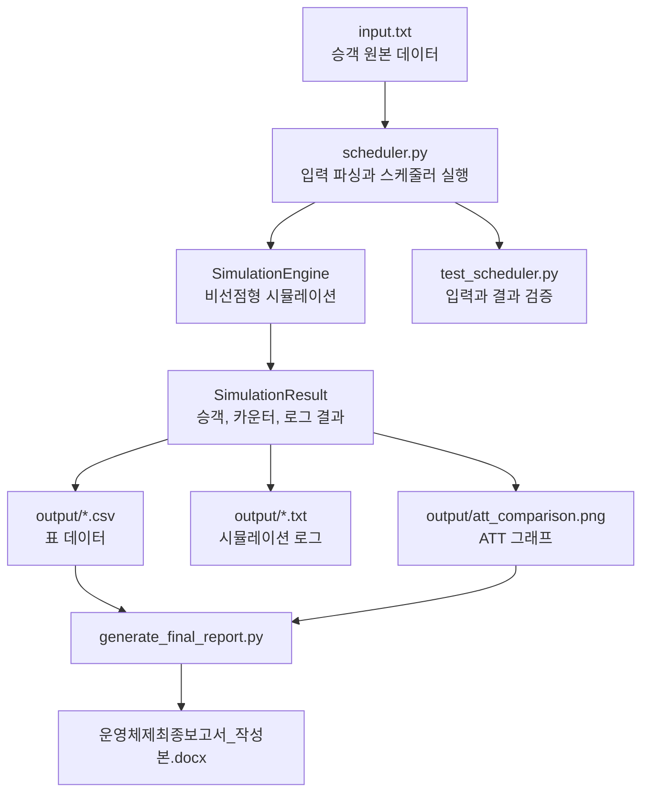

# 보고서 생성 흐름

## 전체 연결 관계

이 프로젝트의 데이터 흐름은 다음 순서로 이어진다.



핵심은 `input.txt → scheduler.py → output → generate_final_report.py → docx` 순서이다.

## 1단계: `input.txt` 준비

`input.txt`는 승객 원본 데이터이다.

각 줄은 다음 4개 값을 가진다.

```text
passenger_id arrival_time class service_time
```

예시:

```text
1	0	3	7
2	0	1	12
```

첫 번째 줄은 `1번 승객`, `시간 0 도착`, `Economy`, `서비스 시간 7`을 의미한다.

## 2단계: `scheduler.py` 실행

결과 파일을 만들려면 다음 명령어를 실행한다.

```powershell
python scheduler.py input.txt --scheduler all --output output
```

이 명령은 네 가지 스케줄러를 모두 실행한다.

| 옵션 | 의미 |
|---|---|
| `input.txt` | 입력 파일 경로 |
| `--scheduler all` | `fcfs`, `priority`, `sjf`, `ours`를 모두 실행 |
| `--output output` | 결과를 `output` 폴더에 저장 |

`scheduler.py` 내부 흐름은 다음과 같다.

```text
parse_input_file()
    ↓
Passenger 객체 생성
    ↓
selected_scheduler_names()
    ↓
run_scheduler()
    ↓
SimulationEngine.run()
    ↓
write_outputs()
```

## 3단계: 입력 파싱

`parse_input_file()`은 `input.txt`를 읽어 `Passenger` 객체 리스트로 바꾼다.

```python
passengers = parse_input_file(args.input)
```

각 줄에서 다음 값을 읽는다.

```python
Passenger(
    passenger_id=passenger_id,
    arrival_time=arrival_time,
    passenger_class=passenger_class,
    service_time=service_time,
)
```

이 단계에서는 아직 카운터 배정이나 완료 시간이 없다. 원본 입력값만 객체에 들어간다.

## 4단계: 스케줄러 실행

`--scheduler all`이면 다음 스케줄러가 모두 실행된다.

```python
SCHEDULER_ORDER = ("fcfs", "priority", "sjf", "ours")
```

각 스케줄러는 `run_scheduler()`로 실행된다.

```python
result = run_scheduler(parse_input_file(INPUT_PATH), scheduler_name)
```

`run_scheduler()`는 스케줄러 객체를 만들고 `SimulationEngine`에 넘긴다.

```python
scheduler = create_scheduler(scheduler_name)
engine = SimulationEngine(passengers=passengers, enable_log=True)
result = engine.run(scheduler)
```

여기서 `SimulationEngine`은 시간을 앞으로 진행시키면서 승객을 카운터에 배정하고, 완료 시간을 계산한다.

## 5단계: 결과 검증

`run_scheduler()` 내부에서는 `_validate_result(result)`도 호출한다.

검증 내용은 다음과 같다.

| 검증 | 의미 |
|---|---|
| 완료 승객 수 확인 | 모든 승객이 처리되었는지 확인 |
| `service_start_time` 확인 | 모든 승객이 시작 시간을 가졌는지 확인 |
| `completion_time` 확인 | 모든 승객이 완료 시간을 가졌는지 확인 |
| `turnaround_time` 확인 | 모든 승객이 TAT 값을 가졌는지 확인 |
| 완료 시간 공식 확인 | `completion_time = service_start_time + service_time` |
| TAT 공식 확인 | `turnaround_time = completion_time - arrival_time` |

`test_scheduler.py`도 비슷한 내용을 자동 테스트로 한 번 더 확인한다.

```powershell
python -m unittest -v test_scheduler.py
```

## 6단계: `output` 파일 생성

시뮬레이션 결과는 `write_outputs()`가 파일로 저장한다.

스케줄러별로 다음 4종류의 파일이 생성된다.

```text
{scheduler}_passenger_results.csv
{scheduler}_class_summary.csv
{scheduler}_counter_summary.csv
{scheduler}_simulation_log.txt
```

예를 들어 `sjf`는 다음 파일을 만든다.

```text
sjf_passenger_results.csv
sjf_class_summary.csv
sjf_counter_summary.csv
sjf_simulation_log.txt
```

그리고 대표 결과 파일도 생성된다.

```text
passenger_results.csv
class_summary.csv
counter_summary.csv
simulation_log.txt
```

`--scheduler all` 실행에서는 `ours`가 대표 결과가 된다.

전체 비교 파일도 생성된다.

```text
att_comparison.csv
att_comparison.png
```

## 7단계: `generate_final_report.py` 실행

결과 파일이 준비되면 다음 명령어로 Word 보고서를 만든다.

```powershell
python generate_final_report.py
```

`main()` 함수가 전체 흐름을 실행한다.

```python
template = find_template()
doc = Document(str(template)) if template else Document()
clear_document_body(doc)
set_default_styles(doc)
```

먼저 Word 템플릿을 찾고, 있으면 템플릿을 열고, 없으면 빈 문서를 만든다.

그 다음 본문을 비우고 기본 스타일을 설정한다.

## 8단계: 보고서 섹션 작성

보고서 내용은 함수별로 나뉘어 생성된다.

```python
add_title_page(doc)
add_toc(doc)
add_design_sections(doc)
add_implementation_sections(doc)
add_results_sections(doc)
add_comparison_sections(doc)
add_tradeoff_section(doc)
add_remaining_sections(doc)
```

각 함수가 만드는 보고서 부분은 다음과 같다.

| 함수 | 보고서 부분 |
|---|---|
| `add_title_page()` | 제목 페이지 |
| `add_toc()` | 목차 |
| `add_design_sections()` | 1. 설계 개요 |
| `add_implementation_sections()` | 2. 구현 |
| `add_results_sections()` | 3. 시뮬레이션 결과 |
| `add_comparison_sections()` | 4. Baseline 비교 분석 |
| `add_tradeoff_section()` | 5. Trade-off 분석 및 한계 |
| `add_remaining_sections()` | 6~8장 |

## 9단계: CSV가 보고서 표로 들어가는 과정

예를 들어 승객별 결과는 다음 코드로 읽는다.

```python
passengers = read_csv(OUTPUT_DIR / "passenger_results.csv")
```

`read_csv()`는 CSV 한 줄을 딕셔너리로 읽는다.

그 다음 표에 넣을 행을 만든다.

```python
rows = [
    [
        row["passenger_id"],
        row["class"],
        row["class_name"],
        row["arrival_time"],
        row["service_time"],
        row["service_start_time"],
        row["completion_time"],
        row["turnaround_time"],
        row["assigned_counter_id"],
    ]
    for row in passengers
]
```

마지막으로 `add_table()`에 넘긴다.

```python
add_table(
    doc,
    ["ID", "등급", "등급명", "arrival", "service", "start", "completion", "turnaround", "counter"],
    rows,
    font_size=7,
)
```

즉, 흐름은 다음과 같다.

```text
CSV 파일
  ↓ read_csv()
딕셔너리 리스트
  ↓ 리스트 컴프리헨션
표 행 리스트
  ↓ add_table()
Word 표
```

## 10단계: PNG가 보고서 그림으로 들어가는 과정

ATT 비교 그래프는 `output/att_comparison.png`에 있다.

```python
graph_path = OUTPUT_DIR / "att_comparison.png"
if graph_path.exists():
    paragraph = doc.add_paragraph()
    paragraph.alignment = WD_ALIGN_PARAGRAPH.CENTER
    run = paragraph.add_run()
    run.add_picture(str(graph_path), width=Inches(5.8))
```

`if graph_path.exists()` 때문에 PNG 파일이 없으면 그림 삽입을 건너뛴다.

파일이 있으면 `run.add_picture()`가 Word 문서에 이미지를 넣는다.

## 11단계: Word 파일 저장

마지막으로 문서를 저장한다.

```python
try:
    doc.save(REPORT_PATH)
    print(REPORT_PATH)
except PermissionError:
    doc.save(REVIEWED_REPORT_PATH)
    print(REVIEWED_REPORT_PATH)
```

기본 저장 위치는 다음 파일이다.

```text
운영체제최종보고서_작성본.docx
```

만약 이 파일이 Word에서 열려 있어서 저장할 수 없으면 다음 파일명으로 저장한다.

```text
운영체제최종보고서_작성본_검토수정.docx
```

## 전체 실행 순서 요약

처음부터 다시 실행하려면 다음 순서로 하면 된다.

```powershell
cd C:\OS_WORKSPACE
python -m unittest -v test_scheduler.py
python scheduler.py input.txt --scheduler all --output output
python generate_final_report.py
```

순서의 의미는 다음과 같다.

| 순서 | 명령 | 목적 |
|---:|---|---|
| 1 | `python -m unittest -v test_scheduler.py` | 입력과 스케줄러 기본 검증 |
| 2 | `python scheduler.py input.txt --scheduler all --output output` | 결과 CSV/TXT/PNG 생성 |
| 3 | `python generate_final_report.py` | 결과 파일을 읽어 Word 보고서 생성 |

## 자주 헷갈리는 부분

`input.txt`는 원본 데이터이다.

`output/*.csv`는 시뮬레이션 결과 데이터이다.

`generate_final_report.py`는 원본 데이터를 계산하지 않고, 이미 계산된 결과 데이터를 읽어 Word 보고서에 넣는다.

따라서 `input.txt`를 수정한 뒤 `generate_final_report.py`만 실행하면 보고서 숫자가 바뀌지 않을 수 있다. 반드시 `scheduler.py`를 먼저 실행해서 `output` 파일을 다시 만들어야 한다.
