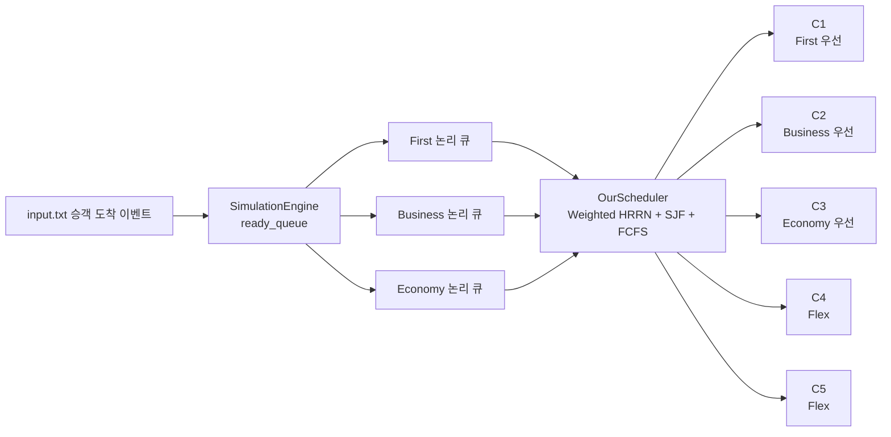
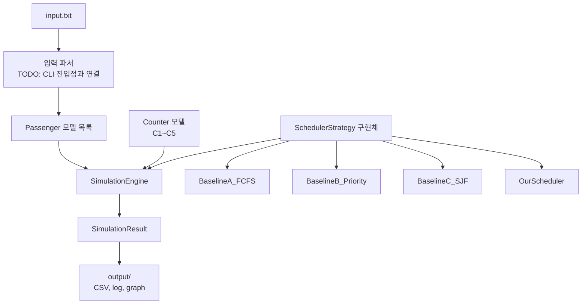

# 운영체제 Term Project 최종 보고서 초안

## 공항 체크인 카운터 스케줄러

- 팀 명: TODO
- 팀 원: TODO
- 작성 기준: `운영체제최종보고서서식(2026년).docx` 목차

## 목차

1. 설계 개요
   - 1.1 큐 아키텍처 설계
   - 1.2 알고리즘 조합 및 근거
   - 1.3 카운터 배정 전략
2. 구현
   - 2.1 시스템 구조
   - 2.2 핵심 모듈 설명
   - 2.3 실행 방법
3. 시뮬레이션 결과
   - 3.1 승객별 결과 (기본 데이터셋)
   - 3.2 등급별 평균 Turnaround Time
   - 3.3 카운터별 통계
4. Baseline 비교 분석
   - 4.1 ATT 비교 표
   - 4.2 비교 분석
5. Trade-off 분석 및 한계
6. 역할 분담 및 기여도
7. 생성형 AI 활용 경험
8. 결론

## 1. 설계 개요

본 프로젝트는 공항 체크인 카운터 5개를 대상으로 승객의 도착 시각, 좌석 등급, 서비스 시간을 고려하여 비선점형 스케줄링을 수행하는 시뮬레이터를 설계한다. 목표는 전체 평균 Turnaround Time(ATT)을 줄이면서도 First, Business, Economy 등급 간 대기 시간 편차와 starvation 가능성을 완화하는 것이다.

시뮬레이션은 운영체제의 CPU 스케줄링 문제와 유사하게 모델링했다. 승객은 프로세스, 체크인 카운터는 병렬 서버 또는 CPU, 서비스 시간은 CPU burst time, 도착 시각은 arrival time에 대응한다. 한 승객이 카운터에 배정되면 서비스 완료 전까지 중단하지 않는 비선점형 정책을 적용하며, context switching overhead는 0으로 가정한다.

우리 팀 스케줄러는 단일 기준만 사용하는 FCFS, 고정 Priority, SJF의 약점을 줄이기 위해 Multi-Level Queue, Priority Weight, HRRN/Aging, SJF tie-break, FCFS tie-break를 조합한 하이브리드 방식으로 설계했다. 즉, 등급 정책은 유지하되 오래 기다린 승객의 점수가 시간이 지날수록 증가하도록 하여 낮은 등급 승객이 무기한 밀리지 않게 한다.

## 1.1 큐 아키텍처 설계

전체 구조는 Hybrid Multi-Level Queue 방식이다. `SimulationEngine`은 실제 자료구조로 하나의 `ready_queue`를 유지하고, `OurScheduler`가 승객 선택 시점마다 이를 First, Business, Economy 논리 큐로 분리한다. 물리적으로 큐를 여러 개 중복 관리하지 않으므로 도착 처리와 정렬은 단순하게 유지하면서, 선택 단계에서는 등급별 정책을 적용할 수 있다.



큐의 역할은 다음과 같다.

| 논리 큐 | 포함 승객 | 주 적용 정책 | 목적 |
| --- | --- | --- | --- |
| First Queue | class = 1 | Priority Weight + HRRN | First 승객의 서비스 품질 보장 |
| Business Queue | class = 2 | Priority Weight + HRRN | 중간 우선순위 승객의 대기 완화 |
| Economy Queue | class = 3 | HRRN/Aging + SJF tie-break | 많은 승객 수에서 starvation 방지 |
| 전체 Ready Queue | 모든 도착 완료 승객 | Flex 카운터 및 borrowing 후보군 | 유휴 카운터 최소화 |

각 큐에서 승객을 선택할 때는 다음 점수를 사용한다.

```text
waiting_time = current_time - arrival_time
response_ratio = (waiting_time + service_time) / service_time
weighted_score = response_ratio * class_weight
```

`class_weight`는 First, Business, Economy 순으로 크게 두어 상위 등급 승객에게 우선권을 부여한다. 단, HRRN의 response ratio가 대기 시간에 따라 증가하므로 Economy 승객도 오래 기다리면 점수가 상승한다.

## 1.2 알고리즘 조합 및 근거

우리 팀 스케줄러는 비선점형 스케줄링 알고리즘을 조합해 단일 알고리즘의 약점을 보완한다.

| 적용 위치 | 알고리즘 | 선택 근거 | 기대 효과 |
| --- | --- | --- | --- |
| 전체 대기 구조 | Multi-Level Queue | 승객 등급이 명확히 구분되므로 등급별 큐로 분리하면 정책을 독립적으로 적용할 수 있다. | First/Business/Economy 정책을 명확하게 반영 |
| 점수 계산 | Priority Scheduling | First, Business 승객은 항공 서비스 정책상 더 높은 우선순위를 갖는다. | 상위 등급 평균 Turnaround Time 감소 기대 |
| 점수 계산 | HRRN/Aging | HRRN은 대기 시간이 길수록 response ratio가 증가해 starvation을 줄인다. | Economy 또는 긴 대기 승객이 무기한 밀리는 문제 완화 |
| 동점 또는 유사 점수 처리 | Non-preemptive SJF | 짧은 service time 작업을 먼저 처리하면 평균 대기 시간과 ATT를 줄이는 경향이 있다. | 전체 ATT 감소 기대 |
| 최종 tie-break | FCFS | 동일 조건에서는 먼저 도착한 승객을 먼저 처리하는 것이 공정하고 결과가 결정적이다. | 동일 조건의 공정성 및 재현성 확보 |

Baseline A인 FCFS는 공정하고 단순하지만 긴 서비스 시간이 앞에 있으면 convoy effect가 발생할 수 있다. Baseline B인 고정 Priority는 상위 등급에 유리하지만 Economy starvation 위험이 있다. Baseline C인 SJF는 ATT 감소에는 강하지만 등급 정책을 반영하지 못하고 긴 서비스 시간 승객이 계속 밀릴 수 있다. 따라서 우리 팀 스케줄러는 Priority로 등급 정책을 반영하고, HRRN/Aging으로 장기 대기를 보정하며, SJF와 FCFS를 tie-break로 사용한다.

## 1.3 카운터 배정 전략

카운터는 총 5개이며 기본 배정 정책은 다음과 같다.

| 카운터 | 유형 | 기본 우선 처리 대상 | borrowing 허용 여부 |
| --- | --- | --- | --- |
| C1 | First 전용 | First Queue | 허용 |
| C2 | Business 전용 | Business Queue | 허용 |
| C3 | Economy 전용 | Economy Queue | 허용 |
| C4 | Flex | 전체 Ready Queue | 해당 없음 |
| C5 | Flex | 전체 Ready Queue | 해당 없음 |

전용 카운터 C1~C3는 자기 등급 승객이 대기 중이면 해당 등급 큐에서만 후보를 선택한다. 예를 들어 C1이 비었고 First 승객이 대기 중이면 C1은 First Queue 안에서 가장 높은 점수의 승객을 선택한다. 자기 등급 승객이 없다면 borrowing을 허용하여 전체 ready queue에서 가장 높은 점수의 승객을 선택한다.

borrowing을 허용한 이유는 전용 카운터가 자기 등급 승객을 기다리며 놀고 있는 동안 다른 등급 승객의 대기 시간이 증가하면 전체 ATT가 악화되기 때문이다. 다만 이 결정은 "전용 카운터"의 의미를 약하게 만들 수 있으므로, Trade-off 분석에서 별도로 다룬다.

Flex 카운터 C4, C5는 특정 등급에 묶지 않고 전체 ready queue를 후보군으로 사용한다. Flex 카운터는 `weighted_score`가 가장 높은 승객을 먼저 선택하고, 점수가 같으면 service_time이 짧은 승객, arrival_time이 빠른 승객, passenger_id가 작은 승객 순으로 결정한다.

승객 선택 우선순위는 다음과 같다.

1. `weighted_score`가 높은 승객
2. `service_time`이 짧은 승객
3. `arrival_time`이 빠른 승객
4. `passenger_id`가 작은 승객

모든 카운터는 비선점형으로 동작한다. 한 번 승객이 배정되면 `completion_time = service_start_time + service_time`까지 중단 없이 처리한다.

## 2. 구현

## 2.1 시스템 구조

구현은 모델, 시뮬레이션 엔진, 스케줄링 전략을 분리한 Strategy Pattern 구조를 따른다. 같은 `SimulationEngine`에 서로 다른 `SchedulerStrategy`를 주입하여 Baseline과 우리 팀 스케줄러를 동일 조건에서 비교할 수 있게 했다.



주요 파일 구조는 다음과 같다.

| 파일 | 역할 |
| --- | --- |
| `models.py` | `Passenger`, `Counter`, `SimulationResult` 데이터 모델과 기본 카운터 생성 |
| `simulation.py` | 이벤트 기반 비선점형 시뮬레이션 엔진 |
| `strategies.py` | Baseline 및 우리 팀 스케줄러 전략 구현 |
| `input.txt` | 기본 승객 데이터셋 |
| `output/` | 실행 결과 CSV, 로그, 그래프 저장 위치 |
| `scheduler.py` | TODO: 입력 파싱, 스케줄러 선택, 결과 출력용 CLI 진입점 |
| `report_utils.py` | TODO: 결과 집계, CSV 저장, 그래프 생성 유틸리티 |

## 2.2 핵심 모듈 설명

`models.py`는 시뮬레이션의 상태를 표현한다. `Passenger`는 도착 시각, 등급, 서비스 시간, 서비스 시작 시각, 완료 시각, turnaround time, 배정 카운터를 가진다. `Counter`는 현재 처리 중인 승객, busy_until, 처리한 승객 목록, 총 처리 시간, 유휴 시간을 관리한다. `SimulationResult`는 완료 승객 목록과 등급별 평균 Turnaround Time 계산 기능을 제공한다.

`simulation.py`의 `SimulationEngine`은 discrete event simulation 방식으로 동작한다. 매 시간 단위로 1씩 증가시키지 않고, 다음 승객 도착 시각 또는 다음 서비스 완료 시각으로 바로 이동한다. 이 방식은 불필요한 반복을 줄이고 이벤트가 발생하는 시점에서만 상태를 갱신한다.

시뮬레이션 엔진 의사코드는 다음과 같다.

```text
current_time = 0
ready_queue = []
completed = []

while completed_count < total_passenger_count:
    ready_queue에 current_time까지 도착한 승객 추가
    current_time에 완료된 카운터의 승객 완료 처리

    for idle_counter in counters:
        selected = scheduler.select_next_passenger(
            ready_queue, counters, current_time, idle_counter
        )
        if selected exists:
            ready_queue에서 제거
            idle_counter에 배정
            service_start_time 기록
            completion_time 예약

    next_time = min(다음 도착 시각, 다음 완료 시각)
    idle counter의 idle_time 누적
    current_time = next_time
```

`strategies.py`는 공통 인터페이스 `SchedulerStrategy`와 네 가지 스케줄러를 구현한다.

| 클래스 | 설명 |
| --- | --- |
| `BaselineA_FCFS` | arrival_time, passenger_id 순으로 선택 |
| `BaselineB_Priority` | passenger_class, arrival_time, passenger_id 순으로 선택 |
| `BaselineC_SJF` | service_time, arrival_time, passenger_id 순으로 선택 |
| `OurScheduler` | class queue, weighted HRRN, SJF tie-break, FCFS tie-break 조합 |

우리 팀 스케줄러 의사코드는 다음과 같다.

```text
select_next_passenger(ready_queue, counters, current_time, counter):
    class_queues = ready_queue를 passenger_class별로 분리

    if counter가 C1/C2/C3 전용 카운터:
        preferred_queue = 해당 등급 큐
        if preferred_queue가 비어 있지 않음:
            candidate_pool = preferred_queue
        else if borrowing 허용:
            candidate_pool = ready_queue 전체
        else:
            return None
    else:
        candidate_pool = ready_queue 전체

    각 후보 승객에 대해:
        waiting_time = current_time - arrival_time
        response_ratio = (waiting_time + service_time) / service_time
        weighted_score = response_ratio * class_weight

    weighted_score가 가장 높은 승객 선택
    동점이면 service_time 짧은 순, arrival_time 빠른 순, passenger_id 작은 순 선택
```

## 2.3 실행 방법

최종 실행은 CLI 진입점에서 입력 파일, 스케줄러 종류, 출력 폴더를 지정하는 방식으로 구성한다.

```powershell
python scheduler.py input.txt --scheduler all --output output
```

개별 스케줄러만 실행할 때는 다음 옵션을 사용한다.

```powershell
python scheduler.py input.txt --scheduler fcfs --output output
python scheduler.py input.txt --scheduler priority --output output
python scheduler.py input.txt --scheduler sjf --output output
python scheduler.py input.txt --scheduler ours --output output
```

실행 후 생성할 산출물은 다음과 같다.

| 파일 | 내용 |
| --- | --- |
| `output/passenger_results.csv` | 승객별 start, completion, turnaround, assigned counter |
| `output/class_summary.csv` | 등급별 승객 수와 평균 Turnaround Time |
| `output/counter_summary.csv` | 카운터별 처리 승객 수, 총 처리 시간, 유휴 시간 |
| `output/att_comparison.csv` | Baseline과 우리 팀 스케줄러의 ATT 비교 |
| `output/att_comparison.png` | ATT 비교 막대 그래프 |
| `output/simulation_log.txt` | 시간순 이벤트 로그 |

현재 초안 기준으로 CLI 진입점 파일명과 옵션은 구현 완료 후 최종 확인이 필요하다. 보고서 제출 전 위 명령을 실제 실행하여 산출물 파일 생성 여부를 검증한다.

## 3. 시뮬레이션 결과

## 3.1 승객별 결과 (기본 데이터셋)

결과 산출 후 `output/passenger_results.csv`의 전체 승객 결과를 아래 표에 반영한다. 아직 수치 결과는 계산하지 않았으므로 결과 열은 TODO로 둔다.

| ID | 등급 | arrival | service | start | completion | turnaround | counter |
| --- | --- | --- | --- | --- | --- | --- | --- |
| 1 | 3 | 0 | 7 | TODO | TODO | TODO | TODO |
| 2 | 1 | 0 | 12 | TODO | TODO | TODO | TODO |
| 3 | 3 | 1 | 5 | TODO | TODO | TODO | TODO |
| ... | ... | ... | ... | TODO | TODO | TODO | TODO |
| 50 | 3 | 58 | 4 | TODO | TODO | TODO | TODO |

## 3.2 등급별 평균 Turnaround Time

| 등급 | 승객 수 | 평균 Turnaround Time | 비고 |
| --- | --- | --- | --- |
| First (1) | TODO | TODO | TODO |
| Business (2) | TODO | TODO | TODO |
| Economy (3) | TODO | TODO | TODO |
| 전체 ATT | TODO | TODO | TODO |

## 3.3 카운터별 통계

| 카운터 | 유형 | 처리 승객 수 | 총 처리 시간 | 유휴 시간 |
| --- | --- | --- | --- | --- |
| C1 | First 전용 | TODO | TODO | TODO |
| C2 | Business 전용 | TODO | TODO | TODO |
| C3 | Economy 전용 | TODO | TODO | TODO |
| C4 | Flex | TODO | TODO | TODO |
| C5 | Flex | TODO | TODO | TODO |

## 4. Baseline 비교 분석

## 4.1 ATT 비교 표

| 스케줄러 | ATT | Baseline 대비 개선율 |
| --- | --- | --- |
| Baseline A: FCFS | TODO | - |
| Baseline B: Priority (등급 고정) | TODO | - |
| Baseline C: Non-preemptive SJF | TODO | - |
| 우리 팀 스케줄러 | TODO | TODO |

개선율 계산식은 다음과 같다.

```text
improvement_rate = (baseline_ATT - our_ATT) / baseline_ATT * 100
```

## 4.2 비교 분석

Baseline A(FCFS)는 먼저 도착한 승객을 먼저 처리하므로 공정성은 높지만, service_time이 긴 승객이 앞에 배치되면 뒤 승객 전체가 지연되는 convoy effect가 발생할 수 있다. 우리 팀 스케줄러는 SJF tie-break를 사용하므로 같은 수준의 점수에서는 짧은 작업을 먼저 처리해 ATT를 낮출 가능성이 있다. 단, 실제 개선 여부는 TODO 수치 확인 후 작성한다.

Baseline B(Priority)는 First, Business 승객에게 유리하지만 Economy 승객이 계속 밀릴 수 있다. 우리 팀 스케줄러도 등급 가중치를 사용하지만 HRRN/Aging을 함께 적용하므로 오래 기다린 Economy 승객의 점수가 증가한다. 따라서 상위 등급 우선 정책과 starvation 완화 사이의 균형을 기대할 수 있다. 실제 등급별 평균 차이는 TODO 수치 확인 후 작성한다.

Baseline C(SJF)는 전체 ATT를 낮추는 데 유리할 수 있지만, 등급 정책을 반영하지 못하고 service_time이 긴 승객이 지연될 수 있다. 우리 팀 스케줄러는 SJF를 최우선 기준이 아니라 tie-break로 사용하므로 SJF의 ATT 개선 효과를 일부 가져오면서도 Priority와 HRRN을 통해 등급 정책과 장기 대기 보정을 함께 반영한다.

## 5. Trade-off 분석 및 한계

우리 팀 스케줄러의 핵심 trade-off는 전체 ATT 감소와 등급별 공정성 사이의 균형이다. First와 Business에 높은 class weight를 부여하면 상위 등급 승객의 Turnaround Time은 줄어들 가능성이 크지만, Economy 승객의 평균 대기 시간은 증가할 수 있다. 반대로 HRRN/Aging의 영향력을 크게 두면 Economy starvation은 줄어들지만 First/Business 우선 서비스라는 정책적 목적이 약해질 수 있다.

SJF tie-break는 평균 Turnaround Time을 줄이는 데 유리하지만, service_time이 긴 승객에게 불리할 수 있다. 특히 비슷한 weighted score를 가진 승객이 많을 때 짧은 서비스 시간이 반복적으로 먼저 선택되면 긴 서비스 시간 승객의 대기 시간이 늘어난다. HRRN은 이런 문제를 완화하지만 완전히 제거하지는 못한다.

전용 카운터 borrowing 허용도 명확한 장단점이 있다. C1~C3가 자기 등급 승객이 없을 때 다른 등급 승객을 처리하면 idle time을 줄이고 전체 ATT를 낮출 수 있다. 그러나 예를 들어 C1이 Economy 승객을 처리하기 시작한 직후 First 승객이 도착하면, First 승객은 C1이 비워질 때까지 기다려야 한다. 비선점형 조건에서는 이미 시작한 서비스를 중단할 수 없기 때문에 전용 카운터의 서비스 보장성이 약해지는 한계가 있다.

Flex 카운터 C4, C5는 전체 ready queue에서 최고 점수 승객을 선택하므로 활용률을 높이는 데 유리하다. 다만 Flex 카운터가 항상 높은 점수 승객만 선택하면 특정 시점에는 등급별 처리 흐름이 예측하기 어려워질 수 있다. 특히 도착 패턴이 한 등급에 몰리는 경우 Flex 카운터가 해당 등급을 집중 처리하면서 다른 등급의 체감 대기 시간이 증가할 수 있다.

본 스케줄러가 최적이 아닐 수 있는 입력 패턴은 다음과 같다.

| 입력 패턴 | 예상 한계 |
| --- | --- |
| Economy 승객이 짧은 시간에 대량 도착 | HRRN으로 보정해도 상위 등급 가중치 때문에 Economy 평균 Turnaround Time이 커질 수 있음 |
| 긴 service_time 승객이 다수 포함 | SJF tie-break가 긴 작업을 뒤로 밀어 일부 승객의 turnaround가 커질 수 있음 |
| First 승객이 드문드문 늦게 도착 | C1 borrowing 중 First 승객이 도착하면 전용 카운터 대기 문제가 발생할 수 있음 |
| 모든 승객의 service_time이 거의 동일 | SJF 효과가 작아지고 Priority/HRRN 파라미터가 결과를 대부분 결정함 |
| fairness를 ATT보다 더 중시하는 평가 | class_weight 기반 우선순위가 낮은 등급에 불리하게 해석될 수 있음 |

따라서 최종 보고서에서는 전체 ATT뿐 아니라 등급별 평균 Turnaround Time, 카운터별 idle time, 처리 승객 분포를 함께 확인해야 한다. ATT가 개선되더라도 Economy 평균 Turnaround Time이 과도하게 증가했다면 설계상 비용이 발생한 것으로 해석해야 한다. 최종 수치 결과는 TODO로 남기며, 결과 산출 후 trade-off 문단에 구체적인 수치를 반영한다.

## 6. 역할 분담 및 기여도

| 이름 | 학번 | 담당 역할 | 기여도(%) |
| --- | --- | --- | --- |
| TODO | TODO | TODO | TODO |
| TODO | TODO | TODO | TODO |
| TODO | TODO | TODO | TODO |
| TODO | TODO | TODO | TODO |
| 합계 |  |  | 100 |

## 7. 생성형 AI 활용 경험

TODO: 사용한 생성형 AI 도구, 주요 프롬프트, 설계 및 구현에서 도움을 받은 부분, 검증 과정, 한계점을 작성한다.

예시 작성 방향:

- 설계 단계: Baseline 스케줄러와 하이브리드 스케줄러 후보 비교에 활용
- 구현 단계: Strategy Pattern 구조, 이벤트 기반 시뮬레이션 흐름 점검에 활용
- 검증 단계: edge case 목록 작성과 결과 표 형식 정리에 활용
- 한계: 생성된 코드와 설명을 그대로 사용하지 않고 과제 조건 및 실제 실행 결과와 대조해야 했음

## 8. 결론

본 프로젝트는 공항 체크인 문제를 운영체제의 비선점형 스케줄링 문제로 모델링하고, Baseline FCFS, Priority, SJF와 비교 가능한 하이브리드 스케줄러를 설계했다. 핵심 설계는 등급별 논리 큐를 두되, HRRN/Aging으로 장기 대기를 보정하고 SJF와 FCFS를 tie-break로 사용해 ATT와 공정성 사이의 균형을 맞추는 것이다.

최종 결론에는 TODO 수치 결과를 반영해 우리 팀 스케줄러가 어떤 Baseline 대비 개선되었는지, 어떤 등급 또는 입력 패턴에서 한계가 있었는지 구체적으로 정리한다.
